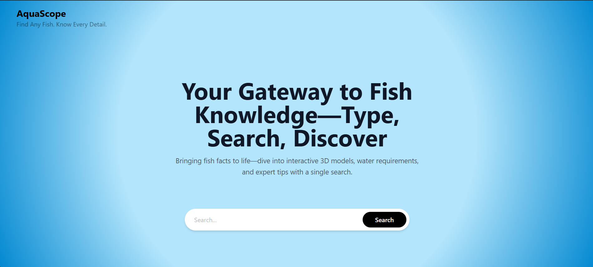
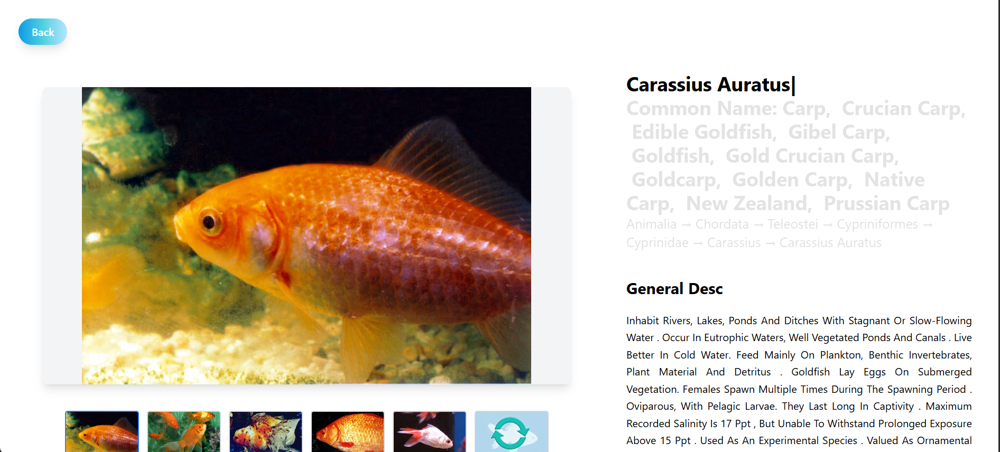
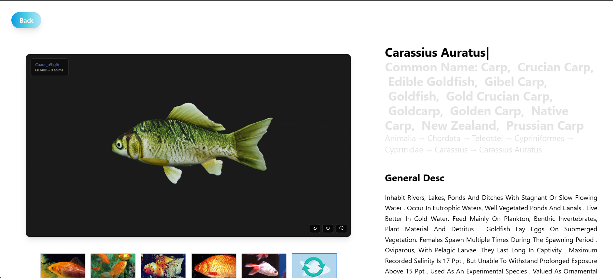

# Fish Encyclopedia - Interactive 3D Fish Information System

## 📖 Project Overview

**Fish Encyclopedia** is an interactive web application that provides comprehensive information about various fish species from around the world. The platform combines rich biological data with stunning 3D models, offering users an immersive educational experience about aquatic life.

Users can search for any fish species and instantly access detailed taxonomic information, habitat data, life cycle details, conservation status, and interactive 3D visualizations—all in one seamless interface.

## 📸 Screenshots

### Landing Page

*Search for any fish species with our beautiful ocean-themed interface*

### Fish Information Page

*Comprehensive details about fish species with image gallery*

### Interactive 3D Model Viewer

*Explore fish in stunning 3D - rotate, zoom, and interact*

## ✨ Key Features

### 🔍 Intelligent Search System
- Real-time fish species search with autocomplete suggestions
- Search by common names or scientific names
- Instant results with comprehensive data retrieval

### 🐟 Comprehensive Fish Information
The application displays detailed information for each fish species:

- **Taxonomic Classification**: Complete hierarchy from Kingdom to Species
- **Common & Scientific Names**: Multiple common names in English with scientific nomenclature
- **Physical Description**: Detailed general descriptions and characteristics
- **Geographic Distribution**: Where the species is found worldwide
- **Habitat & Migration**: Living environment, depth range, and migration patterns
- **Life Cycle & Size**: Reproduction, lifespan, and maximum size information
- **Uses**: Commercial, recreational, and aquarium applications
- **Threats & Diseases**: Conservation status, threats, and common diseases

### 🎨 Interactive 3D Model Viewer
- High-quality 3D models of fish species (when available)
- Rotate, zoom, and explore fish from all angles
- Automatic background polling to load 3D models when ready
- Fallback image gallery when 3D model is processing
- Thumbnail previews of multiple images

### 🎯 Smart Data Processing
- Advanced data cleaning and normalization from API responses
- Removal of reference citations and parenthetical content for clean presentation
- Intelligent parsing of structured biological data
- Error-free handling of missing or incomplete data

### 🌊 Beautiful UI/UX
- Ocean-themed gradient design with calming blue aesthetics
- Fully responsive layout for desktop, tablet, and mobile devices
- Smooth transitions and loading states
- Intuitive navigation with easy back-to-search functionality

## 🛠️ Technical Architecture

### Frontend Stack
- **React 19.1.1**: Modern React with hooks and functional components
- **Vite (Rolldown)**: Lightning-fast build tool and development server
- **React Router DOM v7**: Client-side routing for seamless navigation
- **Tailwind CSS v4**: Utility-first styling with custom gradients
- **JavaScript (ES6+)**: Modern JavaScript features

### Project Structure
```
src/
├── App.jsx                      # Main app component with routing
├── main.jsx                     # Application entry point
├── screens/
│   ├── LandingPage.jsx         # Search interface and hero section
│   ├── FishInfo.jsx            # Detailed fish information page
│   └── LoadingScreen.jsx       # Loading state screen
├── components/
│   ├── Header.jsx              # Navigation header
│   ├── SearchBar.jsx           # Fish search input component
│   ├── ModelViewer.jsx         # 3D model rendering component
│   ├── Loader.jsx              # Loading spinner
│   └── DataCleaning/
│       └── DataCleaners.jsx    # Data parsing and cleaning utilities
└── assets/                      # Static assets
```

## 🔄 How It Works

### 1. **Landing Page**
Users arrive at an attractive landing page with:
- Eye-catching hero text: "Your Gateway to Fish Knowledge"
- Search bar to find any fish species
- Beautiful ocean-themed background with radial gradient

### 2. **Search Process**
When a user searches for a fish:
- The search query is sent to the backend API
- API returns comprehensive data from biological databases (like Encyclopedia of Life)
- Data includes taxonomic info, descriptions, images, and 3D model status

### 3. **Data Processing**
Raw API data is cleaned and organized using specialized functions:
- `getScientificName()`: Extracts and cleans scientific nomenclature
- `getCommonNames()`: Filters English common names
- `getDescription()`: Removes citations and extracts main description
- `getDistribution()`: Parses geographic distribution data
- `getHabitatAndMigration()`: Structures habitat and migration information
- `getLifeCycleAndSize()`: Organizes reproduction and size data
- `getUses()`: Lists commercial, recreational, and aquarium uses
- `getThreatsAndDiseases()`: Details conservation threats and diseases
- `getAllImages()`: Collects photo URLs and 3D model links
- `getAllThumbnails()`: Gathers thumbnail images

### 4. **Fish Information Display**
The `FishInfo` page presents data in organized sections:
- **Top Section**: 3D model viewer (or image gallery) + scientific/common names + taxonomic hierarchy
- **Description Section**: Clean, readable general description
- **Distribution & Habitat**: Geographic range and living conditions
- **Life Cycle & Uses**: Reproduction, size, and human applications
- **Threats & Diseases**: Conservation concerns and health issues

### 5. **3D Model Loading**
The application intelligently handles 3D model availability:
- **Immediate Display**: If 3D model is ready, show it instantly
- **Background Polling**: If processing, poll API every 30 seconds
- **Automatic Update**: When model becomes ready, update display without page reload
- **Fallback Images**: Show photo gallery while waiting for 3D model

### 6. **Navigation**
Users can:
- Click "Back" button to return to search
- Perform new searches to explore different species
- Navigate seamlessly between pages using React Router

## 🌐 API Integration

The application connects to a backend API that provides:
- Fish species data from Encyclopedia of Life (EOL)
- 3D model generation and hosting
- Photo galleries and thumbnails
- Comprehensive biological information

Environment variables required:
```env
VITE_API_URL=<Backend API endpoint>
VITE_API_TOKEN=<API authentication token>
```

## 🚀 Getting Started

### Prerequisites
- Node.js (v16 or higher)
- npm or yarn package manager

### Installation

1. Clone the repository:
```bash
git clone https://github.com/Hunter69240/Majorpp-Frontend.git
cd majorpp
```

2. Install dependencies:
```bash
npm install
```

3. Create `.env` file with API credentials:
```env
VITE_API_URL=your_api_url
VITE_API_TOKEN=your_api_token
```

4. Start development server:
```bash
npm run dev
```

5. Open browser to `http://localhost:5173`

### Build for Production
```bash
npm run build
npm run preview
```

## 📦 Available Scripts

- `npm run dev` - Start development server with hot reload
- `npm run build` - Build optimized production bundle
- `npm run preview` - Preview production build locally
- `npm run lint` - Run ESLint to check code quality

## 🎨 Design Philosophy

The application follows these design principles:
- **User-Centric**: Simple search, rich information, intuitive navigation
- **Visual Appeal**: Ocean-themed aesthetics with professional gradients
- **Performance**: Fast loading, lazy loading of 3D models, optimized rendering
- **Accessibility**: Responsive design, readable text, clear information hierarchy
- **Reliability**: Graceful error handling, fallback content, background data updates

## 🔮 Future Enhancements

Potential features for future versions:
- Advanced search filters (habitat type, conservation status, region)
- Compare multiple fish species side-by-side
- Save favorite fish to user profile
- Share fish information on social media
- Offline mode with cached data
- Multi-language support
- Educational quizzes and games
- Community contributions and comments

## 📄 License

This project is part of the Majorpp-Frontend repository.

## 👥 Contributors

This project was developed as a major educational platform for marine biology enthusiasts, students, and researchers.

- **[Anoop C Kulkarni](https://github.com/anoopckulkarni)** - Developer
- **[NikSterPrime](https://github.com/NikSterPrime)** - Developer

---

**Dive into the world of fish knowledge with our interactive 3D encyclopedia!** 🐠🌊
